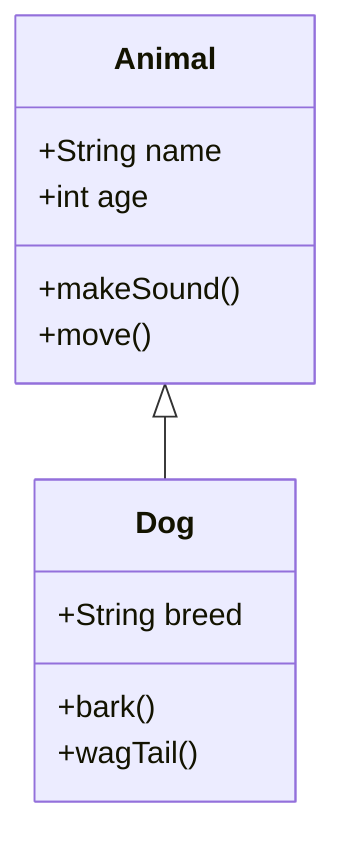
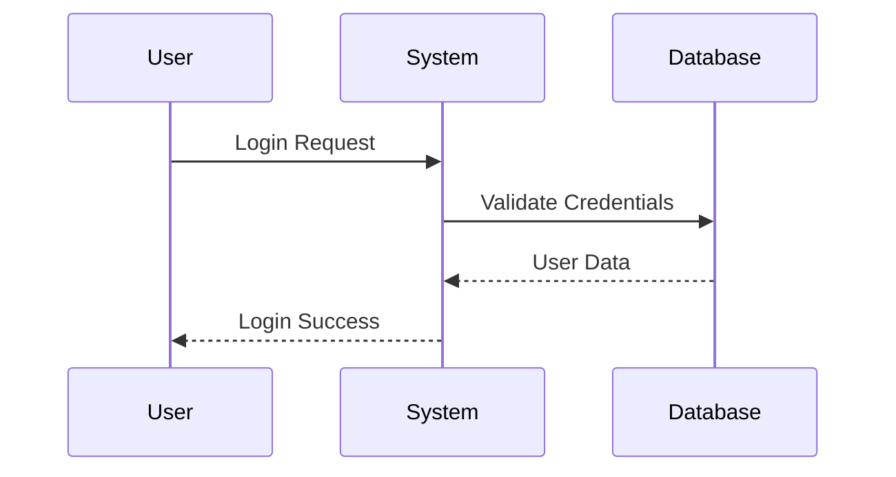
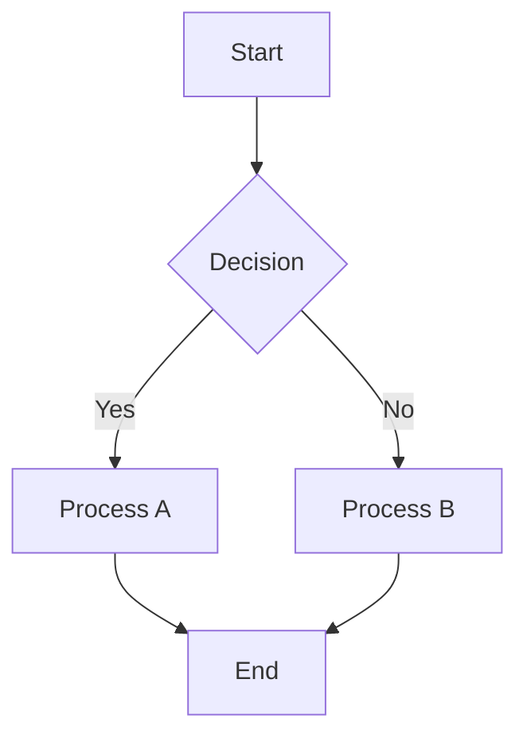

# ColdUML 🎨

A modern, responsive UML diagram editor built with Next.js and Mermaid. Create beautiful UML diagrams with live preview, syntax highlighting, and export capabilities.

## 🚀 Live Demo

**[Try CoolUML →](https://coldUML.vercel.app)**

## ✨ Features

- **Live Preview**: Real-time diagram rendering as you type
- **Syntax Highlighting**: Monaco Editor with custom Mermaid syntax support
- **Dark/Light Theme**: Seamless theme switching with system preference detection
- **Export Options**: Download diagrams as PNG or SVG
- **Template Library**: Quick-start templates for common UML diagrams
- **Responsive Design**: Works perfectly on desktop, tablet, and mobile
- **Copy to Clipboard**: Easy code sharing
- **Error Handling**: Clear error messages for invalid syntax

## 🛠️ Tech Stack

- **Framework**: Next.js 15 with App Router
- **Editor**: Monaco Editor (VS Code editor)
- **Diagrams**: Mermaid.js
- **Styling**: Tailwind CSS 4
- **Language**: TypeScript
- **Deployment**: Vercel

## 📱 Supported Diagram Types

- **Class Diagrams**: Object-oriented design visualization
- **Sequence Diagrams**: Interaction flows between objects
- **State Diagrams**: State machine representations
- **Flowcharts**: Process and decision flows
- **Entity Relationship**: Database schema diagrams
- **And more**: All Mermaid diagram types supported

## 🎯 Quick Start

### Online Editor
Simply visit [coldUML.vercel.app](https://coldUML.vercel.app) and start creating diagrams immediately.

### Local Development

1. **Clone the repository**
   ```bash
   git clone <repository-url>
   cd cooluml
   ```

2. **Install dependencies**
   ```bash
   npm install
   # or
   yarn install
   # or
   pnpm install
   ```

3. **Start development server**
   ```bash
   npm run dev
   # or
   yarn dev
   # or
   pnpm dev
   ```

4. **Open your browser**
   Navigate to [http://localhost:3000](http://localhost:3000)

## 📖 Usage Examples

### Class Diagram


### Sequence Diagram


### Flowchart


## 🎨 Features in Detail

### Editor Features
- **Syntax Highlighting**: Custom Mermaid language support
- **Auto-completion**: Smart suggestions for Mermaid syntax
- **Error Detection**: Real-time syntax validation
- **Theme Support**: Matches system/app theme automatically

### Preview Features
- **Live Rendering**: Updates as you type (with debouncing)
- **Responsive Diagrams**: Auto-scaling for different screen sizes
- **Error Display**: Clear error messages with suggestions
- **Loading States**: Smooth rendering feedback

### Export Options
- **PNG Export**: High-quality raster images
- **SVG Export**: Scalable vector graphics
- **Code Copy**: Share Mermaid code easily
- **Reset Function**: Quick return to default template

## 🔧 Configuration

### Theme Customization
The app supports both light and dark themes with automatic system preference detection. Themes are persisted in localStorage.

### Responsive Layout
- **Mobile**: Vertical stack layout
- **Tablet**: Helper panel on top, editor/preview side-by-side
- **Desktop**: Three-panel layout with helper sidebar

## 🚀 Deployment

### Vercel (Recommended)
1. Connect your GitHub repository to Vercel
2. Deploy automatically on every push
3. Custom domain support available

### Other Platforms
The app is a standard Next.js application and can be deployed on:
- Netlify
- AWS Amplify
- Railway
- Any Node.js hosting platform

## 🤝 Contributing

Contributions are welcome! Please feel free to submit a Pull Request.

### Development Guidelines
1. Follow TypeScript best practices
2. Use Tailwind CSS for styling
3. Maintain responsive design principles
4. Test on multiple devices/browsers
5. Keep accessibility in mind

## 📄 License

This project is open source and available under the [MIT License](LICENSE).

## 🙏 Acknowledgments

- [Mermaid.js](https://mermaid.js.org/) - Diagram generation
- [Monaco Editor](https://microsoft.github.io/monaco-editor/) - Code editor
- [Next.js](https://nextjs.org/) - React framework
- [Tailwind CSS](https://tailwindcss.com/) - Styling framework
- [Vercel](https://vercel.com/) - Deployment platform

## 📞 Support

If you encounter any issues or have questions:
1. Check the [Mermaid documentation](https://mermaid.js.org/intro/)
2. Open an issue on GitHub
3. Visit the live demo for examples

---

**Made with ❤️ by 7sg56**