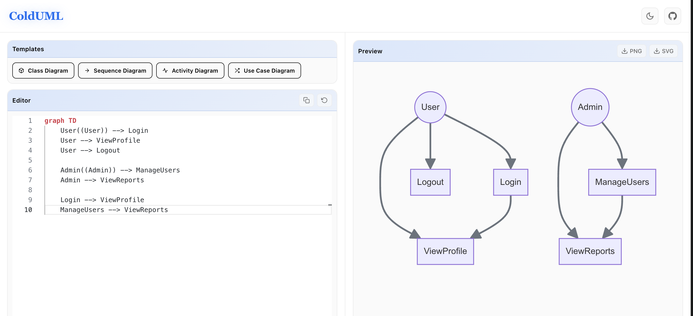
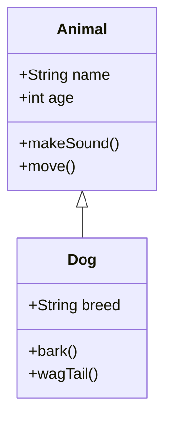
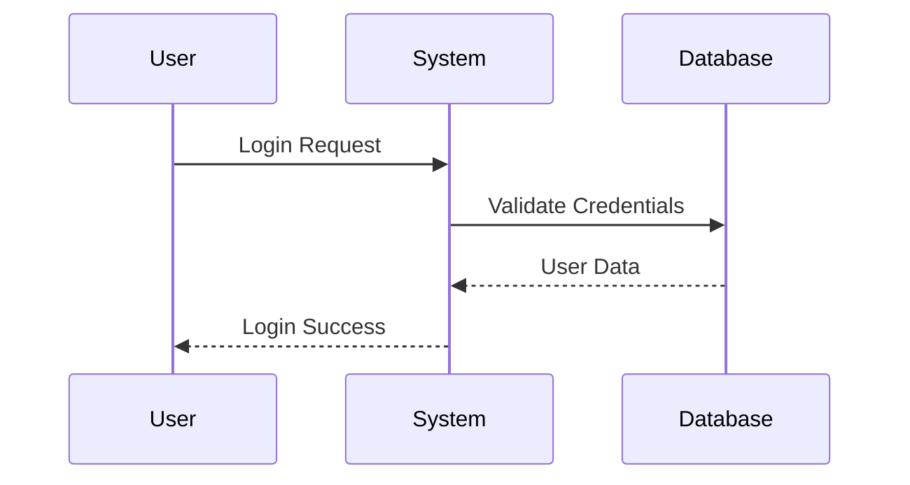
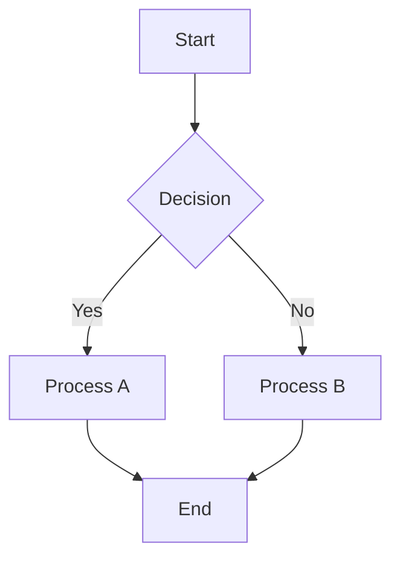

# ColdUML 🎨

A modern UML diagram editor built with Next.js 15 and Mermaid.js. Create beautiful diagrams with real-time preview, Monaco editor, and export capabilities.

**[https://colduml.vercel.app](https://colduml.vercel.app)**



## ✨ Features

- **Monaco Editor** - Full VS Code editor with Mermaid syntax highlighting
- **Live Preview** - Real-time diagram rendering with 300ms debouncing
- **Theme Support** - Light/dark mode with system preference detection
- **Export Options** - Download as PNG or SVG
- **Templates** - Quick-start templates for common UML diagrams
- **Error Detection** - Inline error highlighting with helpful messages
- **Copy to Clipboard** - Share Mermaid code easily

## 🛠️ Tech Stack

- **Framework**: Next.js 15.5.6 with App Router & Turbopack
- **Editor**: Monaco Editor 0.54.0 + @monaco-editor/react 4.7.0
- **Diagrams**: Mermaid.js 10.9.1
- **Styling**: Tailwind CSS 4 with PostCSS
- **Language**: TypeScript 5
- **Icons**: React Icons 5.5.0
- **Runtime**: React 19.1.0
- **Deployment**: Vercel

## 📱 Supported Diagram Types

ColdUML supports all Mermaid.js diagram types:

- **Class Diagrams** - Object-oriented design and relationships
- **Sequence Diagrams** - Interaction flows and message passing
- **Flowcharts** - Process flows and decision trees
- **State Diagrams** - State machines and transitions
- **Entity Relationship Diagrams** - Database schemas
- **Gantt Charts** - Project timelines
- **Pie Charts** - Data visualization
- **Git Graphs** - Version control flows
- **User Journey** - UX journey mapping
- **And more** - Full Mermaid.js compatibility

## 🎯 Quick Start

### Online Editor
Simply visit [colduml.vercel.app](https://colduml.vercel.app) and start creating diagrams immediately - no installation required!

### Local Development

1. **Clone the repository**
   ```bash
   git clone https://github.com/7sg56/ColdUML.git
   cd cooluml
   ```

2. **Install dependencies**
   ```bash
   npm install
   ```

3. **Start development server with Turbopack**
   ```bash
   npm run dev
   ```
   This uses Next.js Turbopack for faster development builds.

4. **Open your browser**
   Navigate to [http://localhost:3000](http://localhost:3000)

### Build for Production

```bash
npm run build
npm start
```

## 📖 Usage Examples

### Class Diagram


### Sequence Diagram


### Flowchart


## 📁 Project Structure

```
cooluml/
├── app/                    # Next.js 15 App Router
│   ├── page.tsx           # Main editor page component
│   ├── layout.tsx         # Root layout with metadata
│   ├── globals.css        # Global styles & theme variables
│   └── not-found.tsx      # 404 page
├── components/            # React components
│   ├── Header.tsx         # App header with theme toggle
│   ├── SimpleEditor.tsx   # Monaco editor wrapper
│   ├── SimplePreview.tsx  # Mermaid preview renderer
│   └── UMLTemplates.tsx   # Template selector
├── lib/                   # Utility functions
│   ├── export-utils.ts    # PNG/SVG export logic
│   ├── clipboard.ts       # Clipboard operations
│   ├── editor-utils.ts    # Editor helper functions
│   └── toast-utils.ts     # Toast notification system
├── types/                 # TypeScript definitions
│   └── global.d.ts        # Global type declarations
└── public/                # Static assets
```

## 🎨 Component Overview

### Header Component
- Theme toggle with loading states
- GitHub repository link
- Responsive design with smooth animations

### SimpleEditor Component
- Monaco editor integration with custom Mermaid language definition
- Syntax highlighting with keyword, operator, and string detection
- Custom Vercel-inspired themes (light/dark)
- Error highlighting with inline markers
- Copy code and reset functionality
- Template insertion support

### SimplePreview Component
- Real-time Mermaid diagram rendering
- Error handling with user-friendly messages
- Loading states with spinners
- Empty state placeholders
- Theme-aware diagram styling
- Export button controls

### UMLTemplates Component
- Quick-access template buttons
- Icons for visual recognition (Class, Sequence, Activity, Use Case)
- Active state animations
- One-click template insertion

## 🔧 Configuration

### Theme System
```typescript
// Themes are automatically detected and persisted
- System preference detection via prefers-color-scheme
- localStorage persistence
- Smooth CSS transitions (0.3s ease)
- Custom CSS variables for easy theming
```

### Monaco Editor Setup
```typescript
// Custom Mermaid language definition
- Keywords: classDiagram, sequenceDiagram, flowchart, etc.
- Operators: Relationship symbols (<|-, ->, etc.)
- Token-based syntax highlighting
- GitHub-inspired color schemes
```

### Mermaid Configuration
```typescript
// Rendering settings
- Theme: Matches app theme (dark/default)
- Security: Loose (allows all diagram types)
- Font: Arial for consistent rendering
- Auto-scaling: Responsive SVG output
```

## 🚀 Deployment

### Vercel (Recommended)

ColdUML is optimized for Vercel deployment with zero configuration:

```bash
# Deploy to Vercel
npm install -g vercel
vercel
```

Or connect your GitHub repository:
1. Import project to Vercel
2. Auto-detected as Next.js with Turbopack
3. Automatic deployments on git push
4. Environment variables (if needed)
5. Custom domain support

### Environment Variables
No environment variables required - ColdUML is a fully client-side application!

### Other Platforms
Being a standard Next.js 15 app, ColdUML can be deployed on:
- **Netlify**: Next.js runtime support
- **AWS Amplify**: Full SSR and static hosting
- **Railway**: One-click deployment
- **Cloudflare Pages**: With Node.js compatibility
- **Self-hosted**: Any Node.js 18+ environment

## 🤝 Contributing

Contributions are welcome! Here's how you can help:

### Development Guidelines
1. **Code Style**
   - Follow TypeScript strict mode
   - Use React functional components with hooks
   - Maintain existing component structure
   - Follow Tailwind CSS utility-first approach

2. **Testing**
   - Test on multiple browsers (Chrome, Firefox, Safari, Edge)
   - Verify mobile responsiveness
   - Test both light and dark themes
   - Validate Mermaid syntax edge cases

3. **Pull Requests**
   - Create feature branches from `main`
   - Write clear commit messages
   - Update README if adding features
   - Ensure build succeeds (`npm run build`)

4. **Accessibility**
   - Maintain ARIA labels
   - Ensure keyboard navigation works
   - Test with screen readers
   - Keep color contrast ratios accessible

### Branching Strategy
- `main` - Production-ready code
- `mobile-responsive-layout` - Mobile optimization features
- Feature branches - New features and experiments

## 📄 License

This project is open source and available under the [MIT License](LICENSE).

## 🙏 Acknowledgments

- [Mermaid.js](https://mermaid.js.org/) - Diagram generation
- [Monaco Editor](https://microsoft.github.io/monaco-editor/) - Code editor
- [Next.js](https://nextjs.org/) - React framework
- [Tailwind CSS](https://tailwindcss.com/) - Styling framework
- [Vercel](https://vercel.com/) - Deployment platform

## 📞 Support

If you encounter any issues or have questions:
1. Check the [Mermaid documentation](https://mermaid.js.org/intro/)
2. Open an issue on GitHub
3. Visit the live demo for examples

---

**Made with ❤️ by 7sg56**